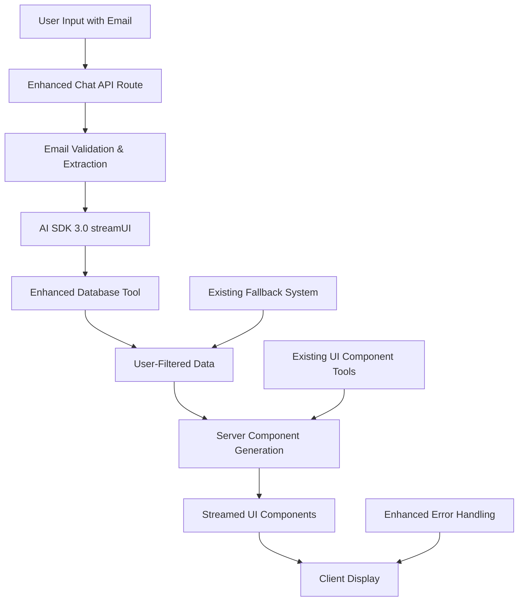

# Design Document

## Overview

This design document outlines the implementation of Vercel AI SDK 3.0's Generative UI capabilities for the TechTrend Support Chatbot. The solution transforms the existing text-based chatbot into a rich, component-based interface that streams React Server Components directly from LLM responses while maintaining strict user data security through email-based authentication.

## Architecture

### Current System Analysis

The existing system already has:
- **AI SDK Integration**: Using `generateText` with Google Gemini
- **Database Tool**: `databaseQueryTool` with fallback mock data
- **UI Component Tools**: `userCardTool`, `productCardTool`, `orderCardTool`, `supportTicketCardTool`
- **Card Components**: Client-side React components for displaying data
- **Email Processing**: Basic email extraction and normalization

### Enhanced Architecture with AI SDK 3.0



### Security Enhancement Strategy

Building on the existing system:

1. **Enhanced Email Validation**: Strengthen existing email extraction
2. **Query Filtering**: Modify existing `databaseQueryTool` to require email
3. **Data Isolation**: Add session-based data separation
4. **Error Sanitization**: Enhance existing error handling

## Components and Interfaces

### Enhanced Chat API Route

The existing `/api/chat/route.js` will be upgraded to support Vercel AI SDK 3.0's `streamUI` function while preserving the current architecture:

```javascript
// Enhanced imports for AI SDK 3.0
import { streamUI } from 'ai/rsc';
import { google } from '@ai-sdk/google';
import { z } from 'zod';
import { SYSTEM_PROMPT } from './system-prompt';
import { enhancedDatabaseQueryTool } from '../../../lib/tools/database';

export async function POST(req) {
  const requestId = nanoid();
  const { messages } = await req.json();
  
  // Enhanced email extraction from existing logic
  const userEmail = extractEmailFromMessages(messages);
  
  const result = await streamUI({
    model: google('gemini-1.5-flash'),
    system: SYSTEM_PROMPT,
    messages,
    tools: {
      // Enhanced database tool with email requirement
      databaseQuery: {
        description: 'Query user-specific database with email authentication',
        parameters: z.object({
          email: z.string().email().describe('User email for data filtering'),
          type: z.enum(['customer', 'product', 'order', 'ticket']),
          query: z.string().describe('Search query or identifier')
        }),
        generate: async ({ email, type, query }) => {
          // Use enhanced database tool
          const data = await enhancedDatabaseQueryTool.execute({
            type,
            identifiers: [{ email, ...parseQuery(query) }]
          });
          
          // Generate appropriate UI components based on data type
          return generateDataComponents(data, email);
        }
      }
    },
    temperature: 0.2,
  });
  
  return result.toDataStreamResponse();
}
```

### Secure Database Tool Enhancement

The existing database tool will be enhanced with strict email-based filtering:

```javascript
// Enhanced database tool with email requirement
const secureUserDataTool = tool({
  description: 'Query user-specific data with email authentication',
  parameters: z.object({
    email: z.string().email().describe('User email for data filtering'),
    type: z.enum(['customer', 'orders', 'tickets']),
    limit: z.number().optional().default(10)
  }),
  execute: async ({ email, type, limit }) => {
    // Validate email format
    if (!isValidEmail(email)) {
      throw new Error('Invalid email format provided');
    }
    
    // Query only user-specific data
    const userData = await queryUserSpecificData(email, type, limit);
    
    return {
      type,
      email,
      data: userData,
      count: userData.length
    };
  }
});
```

### React Server Components for Data Display

New server components will be created for streaming UI:

#### UserDataDisplay Component
```javascript
// app/components/server/UserDataDisplay.tsx
import { UserCard } from '../UserCard';
import { OrderCard } from '../OrderCard';
import { TicketCard } from '../TicketCard';

export function UserDataDisplay({ data, type, email }) {
  if (!data || data.length === 0) {
    return (
      <div className="p-4 bg-yellow-50 rounded-lg">
        <p>No {type} found for {email}</p>
        <p className="text-sm text-gray-600">
          Please verify your email address or contact support.
        </p>
      </div>
    );
  }

  return (
    <div className="space-y-4">
      <h3 className="font-semibold text-lg">
        Your {type.charAt(0).toUpperCase() + type.slice(1)}
      </h3>
      <div className="grid gap-4">
        {data.map((item, index) => {
          switch (type) {
            case 'orders':
              return <OrderCard key={item.id} order={item} />;
            case 'tickets':
              return <TicketCard key={item.id} ticket={item} />;
            case 'profile':
              return <UserCard key={item.id} user={item} />;
            default:
              return <div key={index}>Unknown data type</div>;
          }
        })}
      </div>
    </div>
  );
}
```

#### Enhanced Card Components

The existing card components will be enhanced for server-side rendering:

```javascript
// app/components/OrderCard.tsx (Enhanced)
export function OrderCard({ order }) {
  return (
    <div className="bg-white dark:bg-gray-800 rounded-lg shadow-md p-4 border">
      <div className="flex justify-between items-start mb-3">
        <div>
          <h4 className="font-semibold text-lg">Order #{order.id}</h4>
          <p className="text-sm text-gray-600">{order.product.name}</p>
        </div>
        <StatusBadge status={order.status} />
      </div>
      
      <div className="space-y-2 text-sm">
        <div className="flex justify-between">
          <span>Total:</span>
          <span className="font-medium">${order.product.price}</span>
        </div>
        <div className="flex justify-between">
          <span>Order Date:</span>
          <span>{new Date(order.orderDate).toLocaleDateString()}</span>
        </div>
      </div>
      
      {order.status === 'Shipped' && (
        <div className="mt-3 p-2 bg-blue-50 rounded text-sm">
          <p className="text-blue-800">
            🚚 Your order is on the way! Track your package for updates.
          </p>
        </div>
      )}
    </div>
  );
}
```

## Data Models

### Enhanced User Data Structure

```typescript
interface UserSession {
  email: string;
  sessionId: string;
  lastActivity: Date;
  dataCache?: {
    profile?: CustomerProfile;
    orders?: Order[];
    tickets?: SupportTicket[];
    cacheExpiry: Date;
  };
}

interface SecureQueryParams {
  email: string;
  type: 'customer' | 'orders' | 'tickets';
  limit?: number;
  offset?: number;
}

interface UserDataResponse {
  email: string;
  type: string;
  data: any[];
  count: number;
  hasMore: boolean;
  cached: boolean;
}
```

### Database Query Enhancements

```sql
-- Enhanced queries with email filtering
-- Orders query
SELECT o.*, p.name as product_name, p.price as product_price
FROM "order" o
JOIN customer c ON o.customer_id = c.id
JOIN product p ON o.product_id = p.id
WHERE c.email = $1
ORDER BY o.order_date DESC
LIMIT $2;

-- Support tickets query
SELECT st.*, c.name as customer_name
FROM support_ticket st
JOIN customer c ON st.customer_id = c.id
WHERE c.email = $1
ORDER BY st.created_at DESC
LIMIT $2;

-- Customer profile query
SELECT id, name, email, phone, address, created_at
FROM customer
WHERE email = $1;
```

## Error Handling

### Comprehensive Error Strategy

1. **Email Validation Errors**
   ```javascript
   if (!email || !isValidEmail(email)) {
     return <ErrorComponent 
       message="Please provide a valid email address to view your data"
       type="validation"
     />;
   }
   ```

2. **Database Connection Errors**
   ```javascript
   try {
     const data = await queryDatabase(query, params);
   } catch (error) {
     if (shouldUseFallback(error)) {
       return <FallbackDataDisplay email={email} type={type} />;
     }
     throw new SecureError('Unable to retrieve data at this time');
   }
   ```

3. **Component Rendering Errors**
   ```javascript
   export function ErrorBoundaryWrapper({ children, fallback }) {
     return (
       <ErrorBoundary fallback={fallback}>
         <Suspense fallback={<LoadingSpinner />}>
           {children}
         </Suspense>
       </ErrorBoundary>
     );
   }
   ```

## Testing Strategy

### Unit Testing
- Email validation functions
- Database query filtering
- Component rendering with various data states
- Error handling scenarios

### Integration Testing
- End-to-end user flows with email authentication
- Database tool integration with AI SDK
- Component streaming functionality
- Fallback system behavior

### Security Testing
- SQL injection prevention
- Data isolation between users
- Input sanitization
- Error message sanitization

### Performance Testing
- Component streaming performance
- Database query optimization
- Memory usage with large datasets
- Concurrent user handling

## Implementation Phases

### Phase 1: Core Infrastructure
1. Upgrade to AI SDK 3.0
2. Implement email validation system
3. Enhance database tool with security filters
4. Create basic server components

### Phase 2: UI Components
1. Enhance existing card components for SSR
2. Create UserDataDisplay wrapper component
3. Implement error and loading states
4. Add progressive loading indicators

### Phase 3: Security & Performance
1. Implement comprehensive error handling
2. Add rate limiting and abuse prevention
3. Optimize database queries
4. Add caching layer for user data

### Phase 4: Testing & Deployment
1. Comprehensive testing suite
2. Performance optimization
3. Security audit
4. Production deployment with monitoring

## Security Considerations

### Data Protection
- All queries filtered by authenticated user email
- No cross-user data leakage
- Secure session management
- PII handling compliance

### Input Validation
- Email format validation
- SQL injection prevention
- XSS protection in components
- Rate limiting implementation

### Error Handling
- No sensitive information in error messages
- Graceful degradation
- Secure logging practices
- User-friendly error components